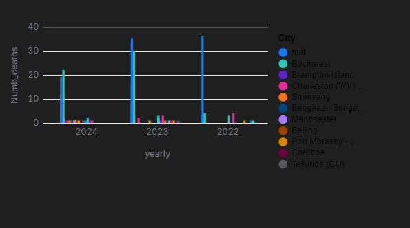
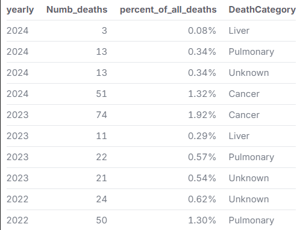
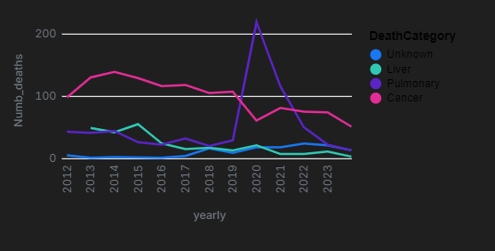
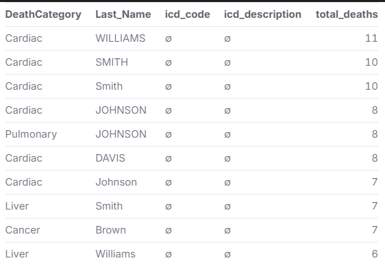
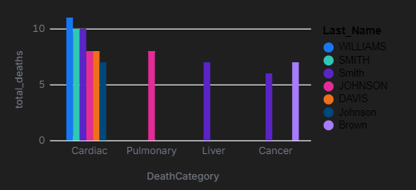
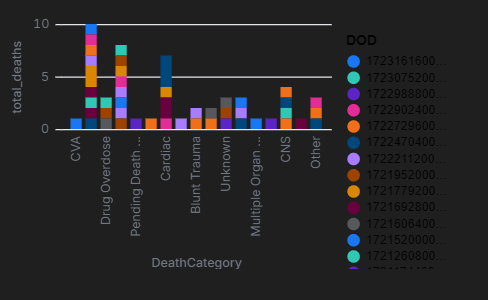
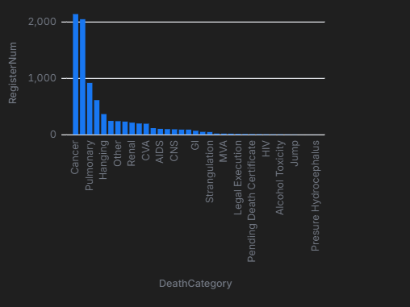

# Federal Inmate Deaths Analysis

## Background
This repository contains datasets and analysis related to **Federal Inmate Deaths**, sourced from the [Data Liberation Project](https://github.com/Sky4soft/Federal-Inmate-Deaths). The goal of this project is to explore patterns and trends in inmate deaths within the federal prison system, analyzing factors such as **death categories, demographic distributions, and geographic trends**.

## Motivation
Underatanding the causes and patterns of inmate deaths is essential for:
- Identifying preventable causes,
- Highlighting public health concerns in the prison system.
- Supporting transparency and accountability within federal institutions.
- Providing insights for policymakers and advocacy groups focused on prison reform.

## Summary of Findings
After analyzing the dataset, several key insights emerged:
- **Cardiac-related deaths** are the most common cause.
- The highest number of deaths occurred during the **COVID-19 pandemic (2020)**.
- Specific institutions consistently report higher death counts.
- The most common death categories are **Cardiac, Cancer, Pulmonary, Liver**, and **Unknown**.
- **Demographic patterns** reveal disparities across sex and race groups.

## Data Sources  
The dataset includes records of federal inmate deaths, providing details such as:  
- **Date of Death (DOD)**  
- **Cause of Death (ICD-10 Codes)**  
- **Demographics (Race, Sex, Age, Location)**  
- **Prison Facility (Institution ID, State, County)**  

## Datasets
- prison.csv: Primary dataset of inmate deaths.
- categories.csv: Category definitions for causes of death.
- Additional support files, such as locationplace.csv and wheretogo.csv are included for geospatial analysis.

## Data Cleaning Steps
To ensure reliable analysis, the following cleaning steps were performed:
- Removed records with incomplete or ambiguous dates.
- Standardized **ICD-10** codes to group causes of death.
- Cleaned and unified inconsistent **city, state**, and **institution ID** fields.
- Filled missing categories with `"Unknown"` to maintain data consistency.
- Filtered out invalid entries or duplicates in the dataset.

## Key Questions Explored  
- What are the most common causes of death in federal prisons?  
- Are certain causes of death more prevalent in specific locations or institutions?  
- How have inmate death rates changed over time?  
- Are there any observable patterns across demographic groups?  

## Visualizations & Analysis  
This project leverages **Malloy** for querying and analyzing the data. Various visualizations, including **bar charts, line graphs, and scatter plots**, are used to enhance data interpretation.  

This graph shows the yearly trends in deaths from Cancer, Liver, Pulmonary, and Unknown causes across different cities and countries.



This data shows the annual distribution of deaths for Cancer, Pulmonary, and Liver categories, and compares these deaths as a percentage of all deaths over the years.




This data shows that cardiac-related deaths are the highest among all categories.




This graph shows that the most common causes of death for male inmates since 2005, broken down by race.



This graph shows the total deaths for each death category (e.g., Cancer, Cardiac) across all genders.



## Getting Started   
1. Clone the repositoy:
git clone https://github.com/Sky4soft/Federal-Inmate-Deaths.git
2. Install Malloy and any required dependencies.
3. Load the dataset files into your environment.
4. Run provided Malloy scripts to reproduce the analysis.
   
## Licensing
This project is licensed under the MIT License. See the [`LICENSE`](LICENSE) file for details.

## Contact
For questions or feedback, please contact the repository owner through GitHub.

## Code
 All code for cleaning, analysis, and visualization is written using **[Malloy](https://malloydata.github.io/)** and available in the `notebooks/` and `scripts/` directories. 

### Installation  
Clone the repository:  
```sh
git clone https://github.com/Sky4soft/Federal-Inmate-Deaths.git
cd Federal-Inmate-Deaths

