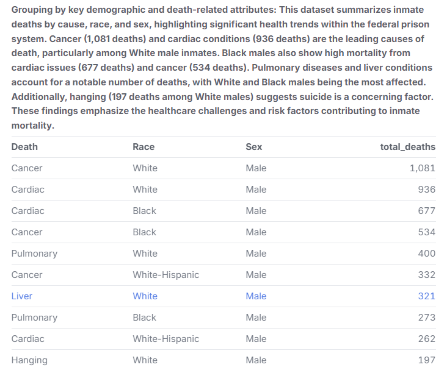
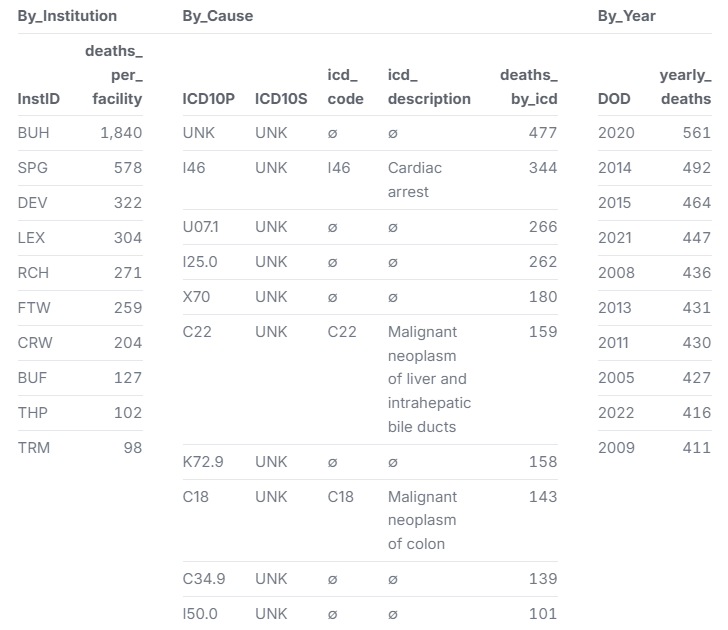
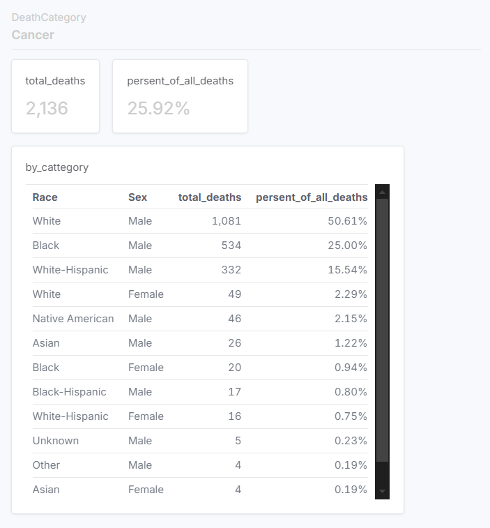
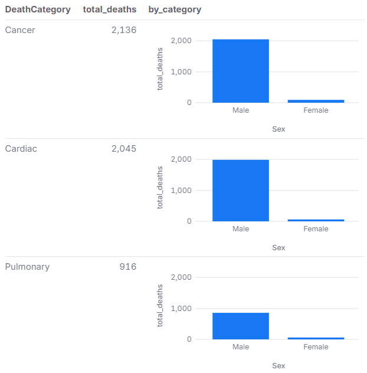

# Federal Inmate Deaths Analysis

## Background
This repository contains data obtained by the [Data Liberation Project](https://www.data-liberation-project.org/), via a [Freedom of Information Act request](https://www.data-liberation-project.org/requests/ssvf-satisfaction-surveys/) to the US Department of Veterans Affairs (VA) and pre-processed by the Data Liberation Project. The goal of this project is to explore patterns and trends in inmate deaths within the federal prison system, analyzing factors such as **death categories, demographic distributions, and geographic trends**.

## FOIA Records
The records provided by the VA by the Data Liberation Project can be viewed [HERE](https://docs.google.com/spreadsheets/d/1VyoVX2PEQXSaUJ9dNTvJ36HNBE5tGLcy/edit?gid=1808560422#gid=1808560422).

## Code
This repository contains one Malloy code file:
- [`prison1.malloynb`](prison1.malloynb), which performs the analysis of the data provided by the Data Liberation Project.

## Motivation
Underatanding the causes and patterns of inmate deaths is essential for:
- Identifying preventable causes,
- Highlighting public health concerns in the prison system.
- Supporting transparency and accountability within federal institutions.
- Providing insights for policymakers and advocacy groups focused on prison reform.

## Summary of Findings

This dataset provides information on federal inmate deaths, including demographic details such as sex, race, and institution (InstID), along with the date of death (DOD), cause of death (DeathCategory), and ICD-10 codes for primary and secondary causes. The most common causes of death in this sample include Cancer, Cardiac conditions, Pulmonary diseases, Liver diseases, Hanging, and Drug Overdose. The data highlights racial and institutional distribution, with White and Black male inmates being the majority of reported deaths. Additionally, multiple institutions are represented, showing the widespread nature of inmate mortality across different facilities.

After analyzing the dataset, several key insights emerged:
- **Cardiac-related deaths** are the most common cause.
- The highest number of deaths occurred during the **COVID-19 pandemic (2020)**.
- Specific institutions consistently report higher death counts.
- The most common death categories are **Cardiac, Cancer, Pulmonary, Liver**, and **Unknown**.
- **Demographic patterns** reveal disparities across sex and race groups.

## Visualizations & Analysis  
This project leverages **Malloy** for querying and analyzing the data. Various visualizations, including **bar charts and line graphs**, are used to enhance data interpretation.  

Below are some key findings from the analysis, presented in a clear and easy-to-understand format.

1. Grouping By Key Demongraphic and Death-Related Attributes.

   
            Figure: Grouping By Demongraphic
            
#### Below is a breakdown of the data results, making it easier to understand the dataset presented in the above figure.

- Dataset Overview: Summarizes inmate deaths by cause, race, and sex, providing insights into health trends within the federal prison system.

- Leading Causes of Death:

    - Cancer: 1,081 deaths (highest among White male inmates).
    - Cardiac Conditions: 936 deaths, with significant impact on White and Black males.

- Mortality Trends by Race & Sex:

    - Black Males: High mortality from cardiac issues (677 deaths) and cancer (534 deaths).
    - Pulmonary Diseases & Liver Conditions: Affected primarily White and Black males.

- Suicide Concerns:

    - Hanging-related deaths: 197 cases, predominantly among White male inmates.

- Key Takeaways:

    - Findings highlight healthcare challenges and risk factors contributing to inmate mortality.
    - Suggests the need for improved medical care and mental health support in federal prisons.

2. This dataset provides insights into federal inmate deaths by institution, cause, and year, highlighting the facilities with the highest mortality rates and the most common causes of death. BUH (1,840 deaths) recorded the highest number of deaths, followed by SPG (578) and DEV (322), suggesting that certain institutions house higher-risk or terminally ill inmates. The leading causes of death include cardiac arrest (I46 - 344 deaths), liver cancer (C22 - 159 deaths), and colon cancer (C18 - 143 deaths). Suicide by hanging (X70 - 180 deaths) and COVID-19 (U07.1 - 266 deaths) also account for a significant portion of deaths. The presence of 477 deaths with unknown ICD-10 classifications (UNK) indicates possible gaps in cause-of-death reporting. This data underscores the health risks, chronic conditions, and systemic challenges contributing to mortality in the federal prison system.

   
            Figure: Insights into Federal Inmate Deaths By Institution
            
#### Below is a breakdown of the data results, making it easier to understand the dataset presented in the above figure.

- Dataset Overview: Provides insights into federal inmate deaths by institution, cause, and year, identifying facilities with the highest mortality rates.

- Institutions with Highest Deaths:
    - BUH: 1,840 deaths (highest mortality rate).
    - SPG: 578 deaths.
    - DEV: 322 deaths.
    - Suggests certain institutions house higher-risk or terminally ill inmates.

- Leading Causes of Death:
    - Cardiac Arrest (I46): 344 deaths.
    - Liver Cancer (C22): 159 deaths.
    - Colon Cancer (C18): 143 deaths.

- Other Notable Causes:
    - Suicide by Hanging (X70): 180 deaths.
    - COVID-19 (U07.1): 266 deaths.

- Data Gaps & Reporting Issues:
    - 477 deaths classified as "UNK" (Unknown ICD-10 codes) indicate possible gaps in cause-of-death reporting.

- Key Takeaways:
    - Highlights health risks, chronic conditions, and systemic challenges in federal prison healthcare.
    - Suggests the need for improved medical care and cause-of-death documentation.

3. This graph illustrates yearly inmate deaths from 2012 to 2023, categorized by Pulmonary, Cancer, Liver, and Unknown causes. Cancer-related deaths consistently remain the highest, followed by Pulmonary and Liver diseases, indicating that chronic illnesses are major contributors to inmate mortality. A significant spike in deaths occurred in 2020, likely due to COVID-19 and other health complications. The Unknown category suggests gaps in medical reporting or classification. Overall, the data highlights long-term health challenges in the prison system, emphasizing the need for improved medical care and disease prevention strategies.

   
            Figure: Inmate Deaths Categorized
            
#### Below is a breakdown of the data results, making it easier to understand the dataset presented in the above figure.

- Graph Overview: Displays yearly inmate deaths from 2012 to 2023, categorized by Pulmonary, Cancer, Liver, and Unknown causes.

- Key Trends:
    - Cancer-related deaths consistently remain the highest.
    - Pulmonary and Liver diseases follow, indicating chronic illnesses as major contributors to inmate mortality.

- Notable Spike in 2020:
    - Likely due to COVID-19 and other health complications.

- Unknown Category:
    -Suggests gaps in medical reporting or classification.

- Key Takeaways:
    - Highlights long-term health challenges in the prison system.
    - Emphasizes the need for improved medical care and disease prevention strategies.

4. The data summarizes inmate deaths by race, sex, and percentage of total deaths. White male inmates account for the highest proportion of deaths at 50.61% (1,081 deaths), followed by Black males at 25% (534 deaths) and White-Hispanic males at 15.54% (332 deaths). Female deaths make up a significantly smaller portion, with White females at 2.29% (49 deaths) and Black females at 0.94% (20 deaths). Other racial and gender groups, such as Native American males (2.15%) and Asian males (1.22%), have lower death counts. The data highlights racial and gender disparities in inmate mortality, with a strong male predominance in deaths across all groups.

   
            Figure:Inmate Death
            
#### Below is a breakdown of the data results, making it easier to understand the dataset presented in the above figure.

- Dataset Overview: Summarizes inmate deaths by race, sex, and percentage of total deaths.

- Highest Mortality Groups:
    - White Male Inmates: 50.61% (1,081 deaths) – highest proportion.
    - Black Male Inmates: 25% (534 deaths).
    - White-Hispanic Male Inmates: 15.54% (332 deaths).

- Female Mortality Rates:
    - White Female Inmates: 2.29% (49 deaths).
    - Black Female Inmates: 0.94% (20 deaths).

- Other Racial & Gender Groups:
    - Native American Males: 2.15% of deaths.
    - Asian Males: 1.22% of deaths.

- Key Takeaways:
    - Strong male predominance in inmate deaths across all racial groups.
    - Racial and gender disparities in inmate mortality are evident.

5. The graph presents the top causes of death among federal inmates, highlighting Cancer (2,136 deaths), Cardiac-related deaths (2,045 deaths), and Pulmonary-related deaths (916 deaths) as the leading categories. The data is further broken down by sex, showing the distribution of deaths between male and female inmates. The visualization helps identify trends in mortality within the prison system, emphasizing the most prevalent health conditions contributing to inmate deaths.

   
               Figure: Screenshot of the top causes of death.
    
#### Below is a breakdown of the data results, making it easier to understand the dataset presented in the above figure.

- Graph Overview: Displays the top causes of death among federal inmates.

- Leading Causes of Death:
    - Cancer: 2,136 deaths.
    - Cardiac-related deaths: 2,045 deaths.
    - Pulmonary-related deaths: 916 deaths.

- Breakdown by Sex:
    - Shows distribution of deaths between male and female inmates.

- Key Insights:
    - Highlights major health conditions contributing to inmate deaths.
    - Identifies mortality trends within the prison system.
    - Emphasizes the need for better healthcare and prevention measures in federal facilities.

## Data Sources  
The dataset includes records of federal inmate deaths, providing details such as:  
- **Date of Death (DOD)**  
- **Cause of Death (ICD-10 Codes)**  
- **Demographics (Race, Sex, Age, Location)**  
- **Prison Facility (Institution ID, State, County)**  

## Datasets
- prison.csv: Primary dataset of inmate deaths.
- categories.csv: Category definitions for causes of death.
- Additional support files, such as locationplace.csv and wheretogo.csv are included for geospatial analysis.

## Data Cleaning Steps
To ensure reliable analysis, the following cleaning steps were performed:
- Removed records with incomplete or ambiguous dates.
- Standardized **ICD-10** codes to group causes of death.
- Cleaned and unified inconsistent **city, state**, and **institution ID** fields.
- Filled missing categories with `"Unknown"` to maintain data consistency.
- Filtered out invalid entries or duplicates in the dataset.

# How to Open a Shared GitHub File and Run Malloy Code
To explore the data and run the analyses:

Click on the (https://github.com/Sky4soft/Federal-Inmate-Death2) provided to access the shared repository or file. 

Once on Github, click Shift + period this will load the web editor. Then install the malloy extension. See images below for reference:

| **Step**   | **Image Preview** |
|--------|-----------|
| `Step 1 - Press allow` |  |
| `Step 2 - Click the Blocks, search for Malloy, install` |  |
| `Step 3 - Click Trust` |  |
| `Step 4 - Click a .malloynb file` |  |
| `Step 5 - Press Run` |  |

## Key Questions Explored  
- What are the most common causes of death in federal prisons?  
- Are certain causes of death more prevalent in specific locations or institutions?  
- How have inmate death rates changed over time?  
- Are there any observable patterns across demographic groups?  

## Licensing
The files provided directly via FOIA (see listing above) are, as government documents, now in the public domain. All other data files have been generated by Julie Moore for Gonzaga University Graduate School of Business as part of the MSBA-622-01 Data Science for Business (Spring 2025) course and are available under Creative Commons’ [CC BY-SA 4.0 license terms](https://creativecommons.org/licenses/by-sa/4.0/). This repository’s code is available under the [MIT License terms](https://opensource.org/license/mit/). 
